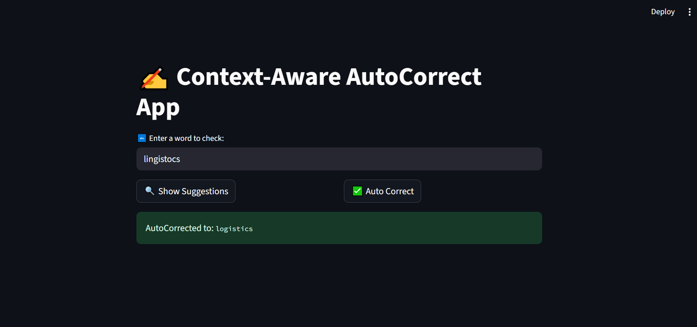
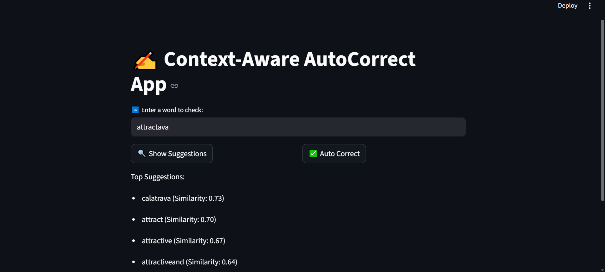

# ✍️ AutoCorrect NLP — Context-Aware Spell Correction Engine

<p align="center">
  <a href="https://streamlit.io/">
    
  </a>
  <a href="https://www.nltk.org/">
    
  </a>
</p>

This repository features a **modular, context-aware spell correction system** that simulates how modern editors (like Gmail, Notion, or smartphone keyboards) detect and fix spelling mistakes in real-time.

The pipeline combines classic NLP techniques like **Levenshtein Distance**, **language modeling**, and **semantic similarity** to provide accurate corrections from a **custom-built vocabulary** extracted from a massive **Kaggle corpus**.

---

## 📥 Dataset Source

- 📚 **Corpus**: [14 Million Word Corpus (Kaggle)](https://www.kaggle.com/datasets/luisgasparcordeiro/14-million-word-corpus-txt)
- 🔤 **Format**: Raw text (`.txt`)
- 🎯 **Purpose**: Build a custom vocabulary with word frequencies

---

## 🎯 Objective

- ✅ Build a vocabulary from a large, real-world corpus
- 🔍 Correct spelling using dictionary, edit distance, and frequency
- 🧠 Add context-aware suggestions via similarity scoring
- 🧪 Deploy via **Streamlit** UI for real-time corrections

---

## 📁 Features

| Component               | Tech Stack              |
|------------------------|-------------------------|
| Corpus Preprocessing   | `re`, `nltk`            |
| Vocabulary Creation    | `Counter`, `stopwords`  |
| Edit Distance          | `textdistance`          |
| Semantic Matching      | `Levenshtein`, `Jaccard`|
| Frontend UI            | `Streamlit`             |

---

## 🧭 Correction Pipeline

| Step                     | Description                                               |
|--------------------------|-----------------------------------------------------------|
| 🧹 Preprocessing          | Clean and tokenize corpus to extract vocabulary           |
| 📦 Vocabulary Building    | Create and persist vocab + frequency dictionary (`.pkl`)  |
| 📚 Word Filtering         | Remove stopwords and symbols                              |
| 🧮 Edit Distance Matching | Compute Jaccard or Levenshtein distances                  |
| 📊 Rank by Frequency      | Use Kaggle corpus frequency to rank suggestions            |
| 🧠 Semantic Suggestion    | Filter by similarity > 0.7 to suggest best alternatives    |
| 🖥️ Streamlit UI           | Display correction and top 5 suggestions interactively     |

---

## 📸 Visuals

### 🔡 AutoCorrect Main UI

<p align="center">

</p>

### 📍 Suggestions Interface

<p align="center">

</p>

## 📦 Folder Structure

```bash
autocorrect_app/
├── data/
│   └── corpus.txt                 # Large corpus text file
├── models/
│   └── vocab.pkl                 # Pickled vocabulary + word freq
├── utils/
│   ├── build_vocab.py            # Script to build and save vocab
│   └── corrector.py              # Spell suggestion and autocorrect
├── interface.py                  # Streamlit frontend interface
├── requirements.txt              # Python dependencies
└── README.md
```

## 🚀 Quickstart

### 🛠️ 1. Create Virtual Environment

```bash
python -m venv venv
source venv/bin/activate  # Windows: venv\Scripts\activate
```

### 📦 2. Install Dependencies

```bash
pip install -r requirements.txt
python -m nltk.downloader stopwords
```

### 📚 3. Build Vocabulary (Run Once)
```python
# run in Python shell or script
from utils.build_vocab import build_vocab
build_vocab("data/enron.txt", "models/vocab.pkl")
```

### 🖥️ 4. Launch Streamlit Interface
```bash
streamlit run interface.py
```

## 🧾 Sample Usage
```bash
Input:  "erors"
Output: "errors"
```

# 📊 Streamlit Interface Features

| Feature               | Description                                      |
|-----------------------|--------------------------------------------------|
| 🔡 Input Box          | Enter one misspelled word at a time              |
| 📍 Suggestion Button  | See top 5 context-aware suggestions              |
| ✅ AutoCorrect Button | Automatically replace with best guess           |

---

# 🧠 Future Work

- ⌨️ Real-time keyboard integration  
- 🌍 Multilingual dictionary support  
- 🧠 Transformer-based correction (e.g., BERT Masking)  
- 🔍 Autocomplete integration with semantic search  

---

# 📚 Learnings

- 📏 **Edit distance + frequency** = strong baseline  
- 🔍 **Semantic filtering** improves context matching  
- 🧠 **Hybrid models** (rule + data) outperform naive methods  
- ⚡ **Streamlit** accelerates UI for NLP tools  

---

# ✍️ Author

- **Name**: Guna Venkat Doddi  
- **Project**: Part of *SSJ3-AI-Agent-Projects*  
- **Contact**: [](https://github.com/Guna-Venkat)

